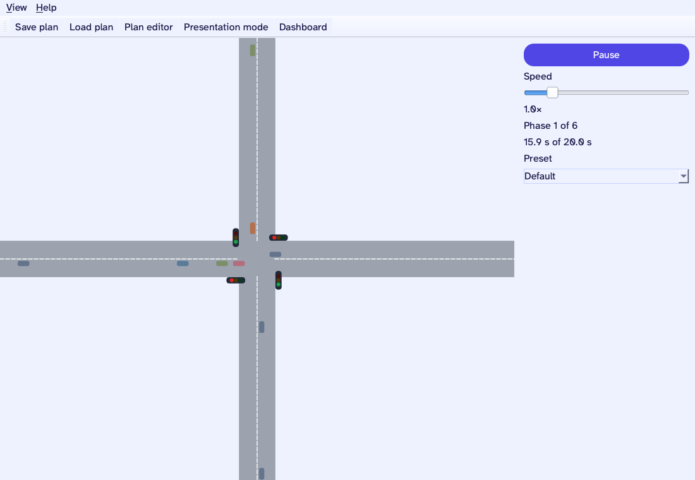
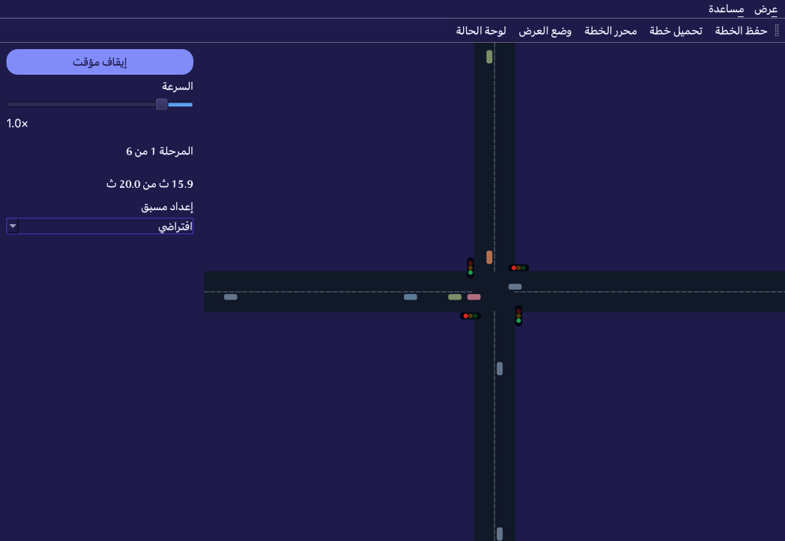

# Traffic Light

[](https://github.com/qtrcipher/traffic-light/actions/workflows/test.yml)

Open-source traffic light intersection simulator for classrooms — Windows & Linux.
محاكي تقاطعات إشارات مرور مفتوح المصدر للفصول الدراسية — Windows وLinux.

Three pillars, built in order: intersection **simulator** (MVP), status **dashboard**,
**hardware controller** (drive a real light over serial/USB).

## Screenshots

| English · light | العربية · dark |
|---|---|
|  |  |

## Features

- Animated 4-way intersection with queueing cars and a deterministic simulation engine
- Status dashboard: big glanceable N/S/E/W lamps mirroring the live signals (great for projection)
- Configurable signal timing plans — edit phases visually, save and share as JSON
- Built-in presets: Default, Rush hour, Night flash
- Presentation mode (F11) for classroom projection
- English & العربية (full RTL), light and dark themes
- Free, MIT-licensed, and collects **no data whatsoever**

Status: v1.0.0 candidate — simulator complete; dashboard and hardware pillars planned.
Roadmap and session log in [PROGRESS.md](PROGRESS.md); validated design in
[docs/plans/2026-08-15-traffic-light-design.md](docs/plans/2026-08-15-traffic-light-design.md).

## Install (no Python needed)

Download the latest one-file build for Windows or Linux from
[Releases](https://github.com/qtrcipher/traffic-light/releases)
(`traffic-light-windows.exe` / `traffic-light-linux`). No installer — run it.

## Develop

```sh
python3 -m venv .venv && source .venv/bin/activate
pip install -e '.[dev]'
pytest                 # headless core tests
traffic-light          # run the app (or: python -m traffic_light.app)
```

## Docker (mirrors CI)

```sh
docker compose run --rm --build test    # headless pytest (Qt offscreen platform)
docker compose run --rm app             # shell in the dev container
```

## Privacy

Data collected: **none**. The app runs fully offline — no accounts, no
analytics, no network calls. Plans you save stay on your machine as JSON files;
settings (language, theme) are stored locally via QSettings.
Full policy (Arabic/English): https://qtrcipher.github.io/traffic-light-privacy/

## Hardware (optional)

Drive a real miniature traffic light that mirrors the simulator. Parts:
an Arduino Uno/Nano (or compatible), 12 LEDs (4× red/amber/green) with
~220 Ω resistors, and a breadboard. Wiring: each LED anode via its resistor to
a pin, cathode to GND — pin map in the comments of
[src/traffic_light/hardware/arduino/traffic_light.ino](src/traffic_light/hardware/arduino/traffic_light.ino)
(N = pins 2–4, S = 5–7, E = 8–10, W = 11–13).

Upload the sketch with the Arduino IDE, then in the app open **Hardware…**,
pick the board's serial port, and press **Connect**. No board? Choose the
**Virtual device (demo)** entry to try the flow without hardware.

## Fonts

The UI bundles [Atkinson Hyperlegible](https://www.brailleinstitute.org/freefont/)
(Latin, © 2020 Braille Institute of America) and
[IBM Plex Sans Arabic](https://www.ibm.com/plex/) (© 2017 IBM Corp.) so text
renders identically on every OS. Both are licensed under the SIL Open Font
License 1.1 — see `src/traffic_light/assets/fonts/*-OFL.txt`.

## License

MIT — see [LICENSE](LICENSE).
